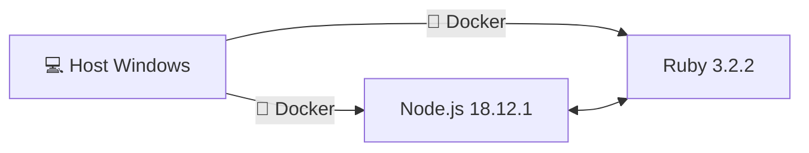

# 📘 Ambiente de Estudos — BDD com Docker


---

Este repositório foi criado para estudos de **BDD (Behavior Driven Development)**, utilizando containers **Docker**
para rodar diferentes tecnologias (Node.js, Ruby, etc.) de forma isolada, mas acessíveis no seu terminal.

> 📚 Saiba mais: [Martin Fowler — BDD](https://martinfowler.com/bliki/BDD.html) | [Cucumber Docs](https://cucumber.io/docs/bdd/)

---

## 📑 Índice Geral

1. [🤔 O que é BDD?](#-o-que-é-bdd)
2. [🏗 Arquitetura do Ambiente](#-arquitetura-do-ambiente)
3. [🐳 Dockerfiles Utilizados](#-dockerfiles-utilizados)
4. [⚙️ Docker Compose](#️-docker-compose)
5. [▶️ Como Rodar o Ambiente](#️-como-rodar-o-ambiente)
   - [Opção 1: Entrar no Container](#opção-1-entrar-no-container)
   - [Opção 2: Usar `docker compose run`](#opção-2-usar-docker-compose-run)
   - [Opção 3: Criar Atalhos no PowerShell (recomendado)](#opção-3-criar-atalhos-no-powershell-recomendado)
6. [📘 Guia Completo de Alias no PowerShell](docker-powershell-alias.md)

---

## 🤔 O que é BDD?

**BDD (Behavior Driven Development)** é uma prática ágil que conecta requisitos de negócio com testes automatizados.  
Ele descreve o comportamento esperado do sistema em **linguagem natural**, facilitando a comunicação entre **negócio, QA e desenvolvimento**.

### ✨ Vantagens do BDD
- ✅ Clareza na comunicação entre times técnicos e não técnicos.  
- ✅ Documentação viva do sistema.  
- ✅ Redução de falhas de entendimento nos requisitos.  
- ✅ Testes automatizados alinhados às regras de negócio.  

### 🏢 Onde é usado
- Times ágeis (Scrum, Kanban).  
- Projetos com **TDD/ATDD**.  
- Ambientes com foco em qualidade e testes automatizados.  

Ferramentas comuns: **Cucumber, SpecFlow, Behave, JBehave**.

---

## 🏗 Arquitetura do Ambiente

Este ambiente utiliza **Docker** para isolar tecnologias de estudo.  
Atualmente estão configurados:

- **Node.js 18.12.1** → para aplicações e APIs.  
- **Ruby 3.2.2** → para scripts, gems e exemplos de BDD.  

### 🔎 Diagrama da Stack



---

## 🐳 Dockerfiles Utilizados

- 📄 `node-18.12.1/Dockerfile` → baseado em **node:18.12.1**, com Corepack habilitado.  
- 📄 `ruby-3.2.2/Dockerfile` → baseado em **ruby:3.2.2**, com pacotes DevKit equivalentes no Linux.  

---

## ⚙️ Docker Compose

O arquivo `docker-compose.yml` está configurado com os seguintes serviços:

- 🟢 **node-18.12.1**  
- 🔴 **ruby-3.2.2**  

Rodar todos os serviços:
```powershell
docker compose up --build -d
```

Encerrar os serviços:
```powershell
docker compose down -v
```

---

## ▶️ Como Rodar o Ambiente

Existem **3 opções** principais para usar os comandos dentro do ambiente Docker:

### 🥇 Opção 1: Entrar no Container
```powershell
docker exec -it ruby-3.2.2 bash
ruby --version
```

### 🥈 Opção 2: Usar `docker compose run`
```powershell
docker compose run --rm ruby-3.2.2 ruby --version
docker compose run --rm node-18.12.1 node --version
```

### 🥉 Opção 3: Criar Atalhos no PowerShell (recomendado)
A opção mais prática é criar funções no PowerShell, para chamar `ruby`, `node`, `npm` como se estivessem instalados no Windows.

📌 O guia detalhado dessa configuração está aqui:  
👉 [Guia de Alias no PowerShell](docker-powershell-alias.md)

---

## ✅ Conclusão

Este ambiente é voltado para **estudos práticos de BDD**, rodando tecnologias em containers Docker.  
Com ele você pode experimentar Node.js, Ruby e futuramente outras stacks, sem precisar instalar nada diretamente no Windows.

> 🚀 **Objetivo**: Facilitar o aprendizado de BDD e práticas modernas de desenvolvimento com um ambiente de estudos simples, reprodutível e isolado.
