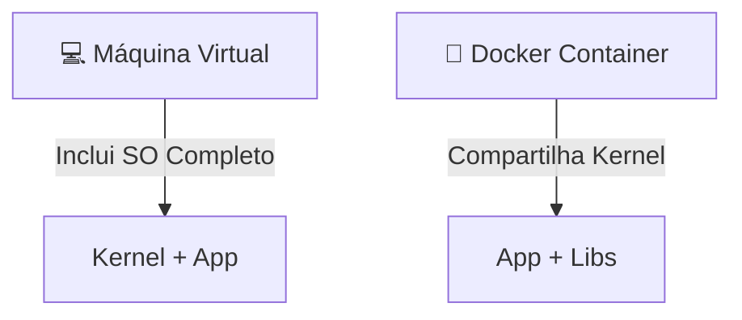

# 🐳 Redmi Underline Docker — Documentação de Estudo

Este é um **guia completo e avançado** sobre Docker, cobrindo desde os conceitos básicos até tópicos avançados como orquestração, segurança e CI/CD.  
O objetivo é servir como material de **estudo e consulta profissional**. 🚀

---

## 📑 Sumário

1. [Introdução ao Docker](#-1-introdução-ao-docker)  
2. [Comandos Essenciais](#-2-comandos-essenciais)  
3. [Volumes e Persistência](#-3-volumes-e-persistência)  
4. [Redes no Docker](#-4-redes-no-docker)  
5. [Dockerfile e Imagens Customizadas](#-5-dockerfile-e-imagens-customizadas)  
6. [Docker Compose](#-6-docker-compose)  
7. [Docker Avançado (Swarm)](#-7-docker-avançado)  
8. [Segurança no Docker](#-8-segurança-no-docker)  
9. [CI/CD com Docker](#-9-cicd-com-docker)  
10. [Limpeza e Manutenção](#-10-limpeza-e-manutenção)  
11. [Monitoramento e Observabilidade](#-11-monitoramento-e-observabilidade)  
12. [Boas Práticas](#-12-boas-práticas)  
13. [Recursos Extras](#-13-recursos-extras)  

---

## 🐳 1. Introdução ao Docker

O **Docker** é uma plataforma de containers que permite criar, implantar e rodar aplicações em ambientes isolados.  

🔑 **Principais conceitos:**  
- **Imagem** → modelo imutável que contém código e dependências.  
- **Container** → instância em execução de uma imagem.  
- **Volume** → mecanismo para persistência de dados.  
- **Rede** → conecta containers entre si.  

### Comparação VM vs Container



Containers são **mais leves e rápidos** que VMs, pois compartilham o kernel do host.

---

## ⚙️ 2. Comandos Essenciais

### 🔍 Verificar instalação
```sh
docker --version
docker info
```

### 📥 Imagens
```sh
docker pull nginx:latest      # Baixar imagem
docker images                 # Listar imagens
docker rmi <image_id>         # Remover imagem
docker inspect <image_id>     # Inspecionar imagem
```

### 📦 Containers
```sh
docker run -d -p 8080:80 nginx     # Rodar container
docker ps                          # Listar containers ativos
docker ps -a                       # Listar todos containers
docker stop <id>                   # Parar container
docker start <id>                  # Iniciar container parado
docker restart <id>                # Reiniciar container
docker rm <id>                     # Remover container
docker exec -it <id> bash          # Acessar terminal
```

### 📊 Logs e Monitoramento
```sh
docker logs -f <id>      # Logs em tempo real
docker stats             # Consumo de CPU/RAM
docker top <id>          # Processos ativos
docker inspect <id>      # Detalhes completos
```

---

## 💾 3. Volumes e Persistência

- **Bind Mounts** → mapeia uma pasta do host.  
- **Volumes** → gerenciados pelo Docker (preferível).  

```sh
docker volume create dados
docker run -d -v dados:/app/data nginx
docker volume ls
docker volume rm dados
```

---

## 🌐 4. Redes no Docker

- **bridge** → rede padrão, containers comunicam entre si.  
- **host** → usa rede do host.  
- **none** → sem rede.  

```sh
docker network ls
docker network create minha_rede
docker network connect minha_rede <container_id>
docker network rm minha_rede
```

---

## 🖼️ 5. Dockerfile e Imagens Customizadas

### Exemplo de `Dockerfile`
```dockerfile
FROM node:18-alpine
WORKDIR /app
COPY package*.json ./
RUN npm install
COPY . .
EXPOSE 3000
CMD ["npm", "start"]
```

### Build e uso
```sh
docker build -t minha_api:1.0 .
docker run -d -p 3000:3000 minha_api:1.0
```

### Multi-stage build
```dockerfile
FROM golang:1.19 AS build
WORKDIR /src
COPY . .
RUN go build -o app

FROM alpine:3.18
COPY --from=build /src/app /app
CMD ["/app"]
```

---

## 🛠️ 6. Docker Compose

Arquivo `docker-compose.yml`:
```yaml
version: "3.9"
services:
  web:
    image: nginx
    ports:
      - "8080:80"
  db:
    image: postgres:15
    environment:
      POSTGRES_PASSWORD: example
```

### Comandos
```sh
docker-compose up -d
docker-compose down
docker-compose logs -f
docker-compose build
```

---

## ⚡ 7. Docker Avançado

### 🔹 Docker Swarm
Orquestração nativa do Docker.  

```sh
docker swarm init
docker service create --replicas 3 -p 8080:80 nginx
docker service ls
docker service ps <service_id>
docker service scale meu_service=5
```

### 🔹 Secrets e Configs
```sh
echo "senha123" | docker secret create db_pass -
docker service create --name meu_app --secret db_pass nginx
```

---

## 🔐 8. Segurança no Docker

- Evite rodar containers como `root`.  
- Use **limitação de recursos**:
```sh
docker run -d --memory="256m" --cpus="1.0" nginx
```
- Prefira **imagens oficiais**.  
- Scaneie vulnerabilidades:
```sh
docker scan <image_id>
```

---

## 🔄 9. CI/CD com Docker

### Build e push no Docker Hub
```sh
docker build -t usuario/minha_api:1.0 .
docker login
docker push usuario/minha_api:1.0
```

### Pipeline (Exemplo GitHub Actions)
```yaml
jobs:
  build:
    runs-on: ubuntu-latest
    steps:
      - uses: actions/checkout@v2
      - name: Build
        run: docker build -t minha_api:latest .
      - name: Push
        run: docker push minha_api:latest
```

---

## 🧹 10. Limpeza e Manutenção
```sh
docker container prune     # Remove containers parados
docker image prune         # Remove imagens antigas
docker volume prune        # Remove volumes não usados
docker system prune -a     # Limpa tudo
```

---

## 📊 11. Monitoramento e Observabilidade

- Logs (`docker logs`)  
- Métricas (`docker stats`)  
- Integração com **Prometheus + Grafana**  
- Ferramentas extras: Portainer, cAdvisor  

---

## ✅ 12. Boas Práticas

✔️ Use **tags específicas** (`nginx:1.23`) em vez de `latest`.  
✔️ Prefira **multi-stage builds**.  
✔️ Organize serviços em **docker-compose**.  
✔️ Monitore containers (`stats`, `logs`).  
✔️ Evite containers privilegiados (`--privileged`).  

---

## 📚 13. Recursos Extras

- 📖 [Documentação Oficial do Docker](https://docs.docker.com/)  
- 📦 [Docker Hub](https://hub.docker.com/)  
- 🎥 [Curso Docker em Português (YouTube)](https://www.youtube.com/playlist?list=PLf-O3X2-mxDlvXQGDvqetZ2x7Hm7JQ4g3)  
- 🧾 [Cheatsheet Docker](https://dockerlabs.collabnix.com/docker/cheatsheet/)  

---

✍️ **Autor:** Documentação criada para **estudos completos de Docker** — nível do básico ao avançado.  
